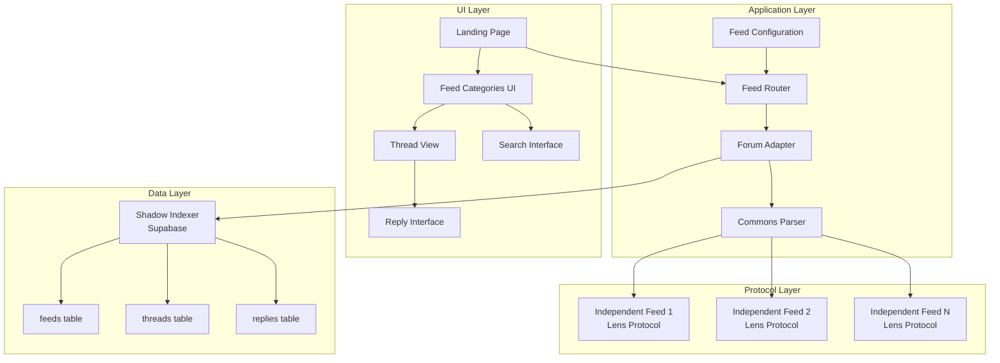
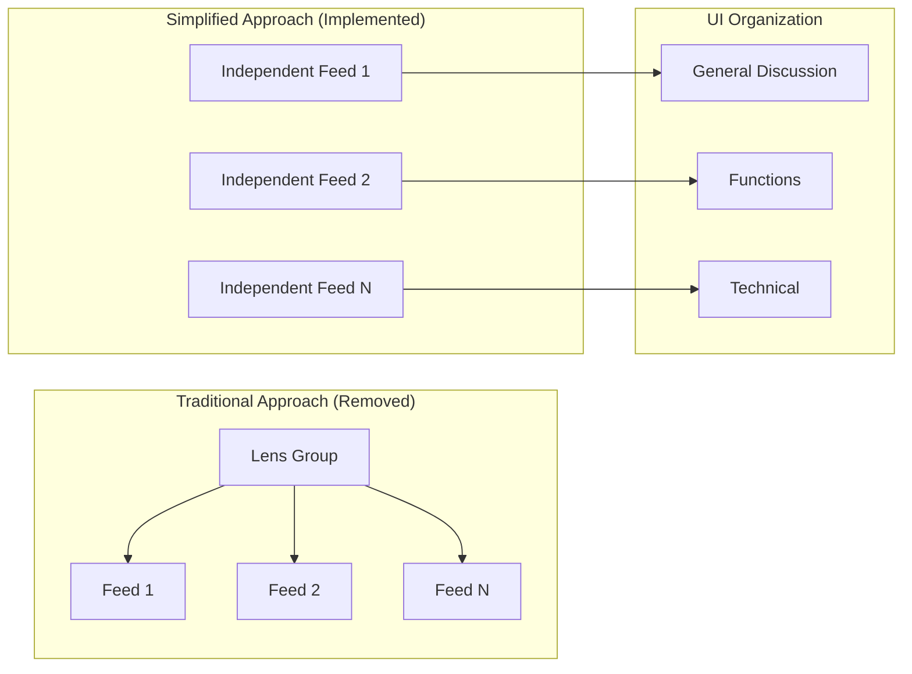
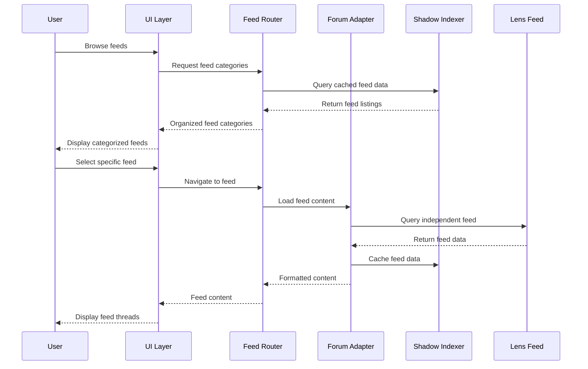
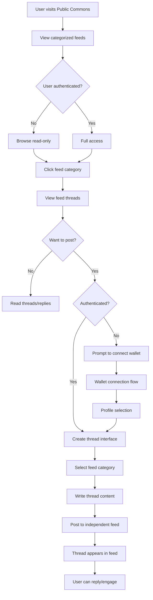
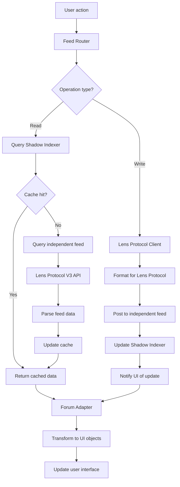

This is a significant data dump, but the architecture here is actually quite elegant. You’re building a decentralized "Discourse" that balances the "Source of Truth" (Lens V3) with a high-performance "Read Layer" (Supabase).

I’ve synthesized your notes into a clean, structured **Project Manifesto & Technical Specification**. This structure moves from the "High-Level Vision" down to the "Gritty Implementation" details.

---

# Society Protocol Forum: Master Specification

## 1. The 3-Tier Architecture

The forum is organized into three distinct "Tiers" to balance global discovery with regional and technical sovereignty.

| Tier       | Name                | Governance Logic            | Visibility & Access                       |
| ---------- | ------------------- | --------------------------- | ----------------------------------------- |
| **Tier 1** | **Public Commons**  | One Lens Group / Many Feeds | Public; Open Join; Unified Indexing       |
| **Tier 2** | **Technical Vault** | Isolated Lens Group         | Gated (Token NFT); Client-side Encryption |
| **Tier 3** | **Local Embassies** | Regional Lens Groups        | Sovereign; Language-based Routing         |

---

## 2. Technical Mapping (The "Plumbing")

This table maps how a user action in the UI translates to blockchain primitives and database entries.

### **Core Primitive Mapping**

| UI Component       | Business Logic     | Lens V3 Primitive       | Supabase Entity   |
| ------------------ | ------------------ | ----------------------- | ----------------- |
| **Root Category**  | Unit of Governance | **Lens Group**          | `root_categories` |
| **Sub-Category**   | Segmented Stream   | **Lens Feed**           | `sub_categories`  |
| **Topic / Thread** | Main Discussion    | **Article Publication** | `threads`         |
| **Reply / Post**   | Engagement         | **Comment Publication** | `replies`         |
| **User Profile**   | Identity           | **Lens Account**        | `profiles_cache`  |

---

## 3. Engineering Guardrails

Based on previous project "scar tissue," these rules are non-negotiable for stability.

### **The "Goldilocks" Stack**

- **Framework**: Next.js 14.2.x & React 18 (Avoid Next 15/React 19 due to Web3 library incompatibilities).
- **Transpilation**: Must include `connectkit` and `walletconnect` in `transpilePackages` in `next.config.mjs`.
- **Polyfills**: Manually disable Node.js modules (`fs`, `net`, `tls`) in Webpack to prevent browser crashes.

### **The 3-Step Handshake (Identity Flow)**

1. **Wallet Connected**: EOA is detected via Wagmi/ConnectKit.
2. **Profile Selected**: User chooses which Lens Profile they want to act as.
3. **Session Active**: A JWT is generated and stored in a **Zustand AuthStore** with persistence.

---

## 4. Shadow Indexing Strategy

To ensure the UI is "instant," we use Supabase as a cache.

- **The Metadata Prefix**: Every Lens post is prefixed with `LearningLens: [Tier]`. This allows the indexer to verify the post belongs to the forum.
- **The Fallback Rule**: If a post is missing from Supabase, the UI must fetch directly from the Lens API to ensure 100% data availability.
- **Flat Replies**: Avoid deep-nested UI bugs. Use a chronological list with "In reply to" badges (quotes) using Markdown references.

---

## 5. Implementation Roadmap

### **Phase 1: Foundations**

- Deploy `SOCIETY_COMMONS_GROUP` and `SOCIETY_VAULT_GROUP` on ZKsync.
- Initialize 15-20 static Lens Feeds for Tier 1.
- Setup `lib/adapters/forum-adapter.ts` to transform raw Lens data into clean UI objects.

### **Phase 2: Authentication**

- Build the **ConnectMonitor** (headless state sync).
- Implement the **Account Picker Dialog** for multi-profile users.

### **Phase 3: The Content Loop**

- Build the **Thread Composer** with Markdown support.
- Deploy **Supabase Edge Functions** to listen for `PostCreated` events.
- Implement the **Vault Service** (Lit Protocol) for decryption.

---

### **Next Step Recommendation**

This organized view clarifies that your **AuthStore** and **Data Adapters** are the most critical "first-build" items.

---

# Requirements Document

## Introduction

Transform the existing LensForum codebase into the Society Protocol Tier 1 Public Commons system - the foundational layer of the 3-tier forum architecture. This system replaces the current multi-community structure with 15-20 independent Lens Feeds, creating a unified public space for global discovery and conversation. The Public Commons serves as the entry point and foundation for the entire Society Protocol Forum ecosystem, with all organization handled at the UI layer for maximum simplicity and flexibility.

## Glossary

- **Public_Commons**: The Tier 1 forum system using independent Lens Feeds with UI-driven organization for discussions
- **Feed_Category**: A predefined discussion topic within the Public Commons, mapped to an independent Lens Feed
- **Root_Section**: Top-level UI organizational grouping of related Feed_Category entries (General Discussion, Functions, etc.)
- **Lens_Feed**: Independent Lens Protocol V3 primitive representing a content stream (no group container needed)
- **Shadow_Indexer**: Supabase-based caching system that mirrors Lens Protocol data for instant UI performance
- **Forum_Adapter**: Service layer that transforms raw Lens Protocol data into forum UI objects
- **Feed_Router**: System component that routes users to specific independent feeds
- **Commons_Parser**: Parser component that processes Lens Protocol data for the Public Commons structure
- **Feed_Configuration**: Environment-based mapping of Feed_Category names to independent Lens Feed addresses

## Requirements

### Requirement 1: Independent Feed Architecture Implementation

**User Story:** As a forum architect, I want to implement independent Lens Feeds with UI-driven organization, so that the system is simple, flexible, and performant.

#### Acceptance Criteria

1. THE Public_Commons SHALL use 15-20 independent Lens_Feed addresses with no group container
2. THE Public_Commons SHALL replace the existing multi-community system with independent feed architecture
3. THE Public_Commons SHALL organize feeds through UI-layer categorization only
4. THE Public_Commons SHALL prevent user creation of new feeds (admin-configured only)
5. THE Public_Commons SHALL maintain admin-only control over Feed_Category configuration through environment variables
6. WHERE individual Lens_Feed addresses are not accessible, THE Public_Commons SHALL display appropriate error messages for that specific feed

### Requirement 2: UI-Driven Feed Organization System

**User Story:** As a user, I want to browse organized discussion feeds, so that I can find conversations on specific topics within the unified commons interface.

#### Acceptance Criteria

1. THE Public_Commons SHALL implement predefined Feed_Category entries mapped to independent Lens_Feed addresses
2. THE Public_Commons SHALL organize feeds into Root_Section groupings through UI presentation: General Discussion, Partner Communities, Functions, Technical Section, and Others
3. THE Public_Commons SHALL display "Beginners & Help" as a pinned feed in the General Discussion section
4. THE Public_Commons SHALL implement "4 Key Concepts" feed covering Energy, Timeline, State, Actors, Accounts, Lifeline, and Death
5. THE Public_Commons SHALL create "Web3 Outpost" feed for Outpost, Badges, and SPEC discussions
6. THE Public_Commons SHALL establish "DAO Governance" feed for governance-related discussions
7. THE Public_Commons SHALL configure Functions section feeds: Economic Game Theory, Function Ideas, Hunting, Property, Parenting, Organizations, Curation, Farming, Portal, and Communication
8. THE Public_Commons SHALL maintain all organizational logic in the UI layer with no protocol-level grouping

### Requirement 3: Public Access and Open Participation

**User Story:** As any internet user, I want to access and participate in the Public Commons, so that I can engage in Society Protocol discussions without barriers.

#### Acceptance Criteria

1. THE Public_Commons SHALL provide public read access to all Feed_Category content across all independent feeds
2. THE Public_Commons SHALL allow open joining without token requirements or gatekeeping
3. THE Public_Commons SHALL implement unified indexing across all independent Lens_Feed addresses
4. THE Public_Commons SHALL enable any authenticated Lens user to post in any Feed_Category
5. THE Public_Commons SHALL maintain public visibility for all discussions and replies across independent feeds
6. WHERE users are not authenticated, THE Public_Commons SHALL still allow read access to all content

### Requirement 4: UI Transformation to Feed Layout

**User Story:** As a user, I want to see feeds instead of communities in the interface, so that I can navigate the new feed-based structure intuitively.

#### Acceptance Criteria

1. THE Public_Commons SHALL replace community listings with Feed_Category listings in the main interface
2. THE Public_Commons SHALL display feeds using the table layout from the HTML mockup with Subject, Replies, Views, and Last Post columns
3. THE Public_Commons SHALL organize the Functions section in a grid layout as specified in the mockup
4. THE Public_Commons SHALL show feed names as clickable links that navigate to feed-specific discussion views
5. THE Public_Commons SHALL display feed statistics (post count, activity) for each Feed_Category
6. THE Public_Commons SHALL implement the exact styling and icons from the provided HTML mockup
7. THE Public_Commons SHALL maintain responsive design for mobile and desktop viewing

### Requirement 5: Lens Protocol Integration Adaptation

**User Story:** As a developer, I want to adapt the existing Lens integration for independent feeds, so that all forum functionality works with the simplified architecture.

#### Acceptance Criteria

1. THE Public_Commons SHALL modify the existing Lens Protocol V3 client to work with independent Lens_Feed addresses
2. THE Public_Commons SHALL update thread creation to post directly to specific independent Lens_Feed addresses
3. THE Public_Commons SHALL adapt reply functionality to work with independent feed structure
4. THE Public_Commons SHALL maintain the existing authentication flow: wallet connection → profile selection → session management
5. THE Public_Commons SHALL preserve the metadata prefix "LearningLens: [Tier1]" for post identification
6. THE Public_Commons SHALL update the Forum_Adapter to transform independent feed Lens data into UI objects
7. THE Public_Commons SHALL eliminate any group-level Lens Protocol operations

### Requirement 6: Shadow Indexing System Adaptation

**User Story:** As a user, I want instant forum performance, so that browsing feeds and discussions is responsive and fast.

#### Acceptance Criteria

1. THE Public_Commons SHALL adapt the existing Supabase shadow indexing for independent feed structure
2. THE Public_Commons SHALL update the `feeds` table to store Feed_Category configurations and independent Lens_Feed address mappings
3. THE Public_Commons SHALL modify the `threads` table to reference Feed_Category and independent feed addresses
4. THE Public_Commons SHALL maintain the `replies` table structure with independent feed-aware indexing
5. THE Public_Commons SHALL implement efficient queries for independent feed-specific content loading
6. THE Public_Commons SHALL maintain sub-200ms response times for feed browsing across independent feeds
7. WHERE Supabase data is missing, THE Public_Commons SHALL fall back to direct Lens Protocol queries to individual feed addresses

### Requirement 7: Feed Navigation and Routing

**User Story:** As a user, I want to navigate between different feeds seamlessly, so that I can explore various discussion topics within the commons.

#### Acceptance Criteria

1. WHEN a user clicks a Feed_Category link, THE Feed_Router SHALL navigate to that feed's discussion view
2. THE Feed_Router SHALL maintain URL structure like `/feed/beginners-help` for specific feeds
3. THE Public_Commons SHALL display breadcrumb navigation showing current feed context
4. THE Public_Commons SHALL provide "Back to Commons" navigation from individual feed views
5. THE Public_Commons SHALL implement feed-specific posting interfaces within each feed view
6. THE Public_Commons SHALL show related feeds or suggested navigation within feed views

### Requirement 8: Content Creation and Management

**User Story:** As a user, I want to create threads and replies within specific feeds, so that I can contribute to organized discussions in the commons.

#### Acceptance Criteria

1. WHEN creating a thread, THE Public_Commons SHALL allow users to select the target Feed_Category
2. THE Public_Commons SHALL post new threads as Article Publications directly to the appropriate independent Lens_Feed
3. THE Public_Commons SHALL post replies as Comment Publications linked to the parent thread on the independent feed
4. THE Public_Commons SHALL maintain thread organization within each independent Feed_Category
5. THE Public_Commons SHALL preserve existing voting and engagement functionality across independent feeds
6. THE Public_Commons SHALL implement feed-aware content moderation and management tools for independent feeds

### Requirement 9: Search and Discovery Enhancement

**User Story:** As a user, I want to search across all feeds in the commons, so that I can find relevant discussions regardless of which independent feed they're in.

#### Acceptance Criteria

1. THE Public_Commons SHALL implement unified search across all Feed_Category content from independent Lens_Feed addresses
2. THE Public_Commons SHALL support filtering search results by specific Feed_Category
3. THE Public_Commons SHALL provide feed-aware search suggestions and autocomplete across independent feeds
4. THE Public_Commons SHALL highlight search terms in results with feed context
5. THE Public_Commons SHALL maintain search performance under 1 second for typical queries across independent feeds
6. THE Public_Commons SHALL implement trending topics discovery across all independent feeds

### Requirement 10: Configuration and Environment Management

**User Story:** As a system administrator, I want to configure independent feed mappings through environment variables, so that I can manage the Public Commons without code changes.

#### Acceptance Criteria

1. THE Public_Commons SHALL support configuration of individual independent Lens_Feed addresses for each Feed_Category
2. THE Public_Commons SHALL allow configuration of Root_Section to Feed_Category mappings through environment variables
3. THE Public_Commons SHALL support easy addition/removal of independent feeds through configuration
4. THE Public_Commons SHALL validate all independent Lens_Feed addresses at startup
5. THE Public_Commons SHALL provide clear error messages for invalid feed configurations
6. THE Public_Commons SHALL maintain backward compatibility with existing environment variable patterns
7. THE Public_Commons SHALL eliminate any group-level configuration requirements

### Requirement 11: Migration from Community System

**User Story:** As a system administrator, I want to migrate existing LensForum data to the independent feed structure, so that historical content is preserved in the new Public Commons.

#### Acceptance Criteria

1. THE Public_Commons SHALL provide migration tools to map existing communities to appropriate independent Feed_Category entries
2. THE Public_Commons SHALL preserve all existing thread and reply data during the transformation to independent feeds
3. THE Public_Commons SHALL maintain user profiles and authentication data without changes
4. THE Public_Commons SHALL update the Shadow_Indexer database schema to reflect independent feed structure
5. THE Public_Commons SHALL validate data integrity after migration completion
6. WHERE automatic mapping is not possible, THE Public_Commons SHALL provide manual assignment interfaces for independent feed mapping

### Requirement 12: Performance and Scalability

**User Story:** As a user, I want the Public Commons to handle high traffic efficiently, so that the forum remains responsive as the community grows.

#### Acceptance Criteria

1. THE Public_Commons SHALL maintain existing Supabase caching performance for independent feed-based queries
2. THE Public_Commons SHALL implement efficient pagination for independent feed content loading
3. THE Public_Commons SHALL cache Feed_Category configurations and independent feed addresses for fast access
4. THE Public_Commons SHALL optimize database queries for the independent feeds structure
5. THE Public_Commons SHALL implement proper loading states during independent feed navigation
6. THE Public_Commons SHALL maintain responsive performance with up to 10,000 concurrent users across independent feeds

### Requirement 13: Parser and Serializer Requirements

**User Story:** As a developer, I want robust parsing of independent feed Lens Protocol data, so that Public Commons content is correctly processed and displayed.

#### Acceptance Criteria

1. WHEN Lens Protocol data is received from independent feeds, THE Commons_Parser SHALL parse it into Feed_Post objects
2. WHEN invalid feed data is received from any independent feed, THE Commons_Parser SHALL return descriptive error messages with specific feed context
3. THE Feed_Serializer SHALL format Feed_Post objects back into valid Lens Protocol format for independent Lens_Feed addresses
4. FOR ALL valid Feed_Post objects, parsing then serializing then parsing SHALL produce equivalent objects (round-trip property)
5. THE Public_Commons SHALL validate all parsed content against the independent feed schema
6. WHERE parsing fails for any independent feed, THE Public_Commons SHALL log errors with specific feed identification and gracefully degrade functionality

### Requirement 14: Brand Integration and Identity

**User Story:** As a user, I want to see clear Society Protocol branding, so that I understand this is the official Public Commons for the Society Protocol community.

#### Acceptance Criteria

1. THE Public_Commons SHALL display "Society Protocol" as the primary brand name in the header
2. THE Public_Commons SHALL use the shield icon as specified in the UI mockup
3. THE Public_Commons SHALL update all page titles to reference "Society Protocol Public Commons"
4. THE Public_Commons SHALL replace any LensForum branding with Society Protocol branding
5. THE Public_Commons SHALL maintain the color scheme and visual identity from the provided HTML mockup
6. THE Public_Commons SHALL include "Powered by Lens Protocol" attribution in the footer

### Requirement 15: Foundation for Multi-Tier Architecture

**User Story:** As a system architect, I want the Public Commons to serve as the foundation for Tier 2 and Tier 3 systems, so that the multi-tier forum architecture can be built upon this base.

#### Acceptance Criteria

1. THE Public_Commons SHALL implement extensible architecture patterns that support additional tiers
2. THE Public_Commons SHALL maintain clear separation between Tier 1 functionality and future tier integrations
3. THE Public_Commons SHALL provide APIs and interfaces that Tier 2 (Technical Vault) can integrate with
4. THE Public_Commons SHALL support cross-tier content discovery and linking mechanisms
5. THE Public_Commons SHALL implement user session management that works across multiple tiers
6. THE Public_Commons SHALL maintain data structures that support tier-aware content organization

---

# Society Protocol Public Commons - Design Document

## Overview

The Society Protocol Public Commons represents a fundamental architectural simplification of the existing LensForum system. By eliminating the complexity of Lens Groups and implementing independent Lens Feeds with UI-driven organization, we create a more flexible, performant, and maintainable foundation for the 3-tier forum architecture.

### Key Architectural Insight

**Independent Lens Feeds are primitives** - they don't require grouping under a single Lens Group. All organization and categorization happens at the UI layer, dramatically simplifying the technical implementation while maintaining the desired user experience.

### Core Benefits

- **Simplified Implementation**: No complex group management or governance overhead
- **Enhanced Performance**: Direct feed access without group-level queries
- **Maximum Flexibility**: Easy addition/removal of feeds through configuration
- **Clean Architecture**: Clear separation between protocol (feeds) and presentation (UI organization)
- **Reduced Complexity**: Eliminates group-level error handling and edge cases

## Architecture

### High-Level Architecture



### Independent Feed Architecture

Unlike the previous single-group approach, each feed operates independently:



### Data Flow Architecture



## Components and Interfaces

### Core Components

#### 1. Feed Configuration Manager

**Purpose**: Manages the mapping between UI categories and independent Lens Feed addresses.

**Interface**:

```typescript
interface FeedConfiguration {
  categoryId: string;
  displayName: string;
  description: string;
  lensFeeds: string[];
  rootSection: RootSection;
  isPinned?: boolean;
  icon?: string;
}

interface FeedConfigurationManager {
  getFeedCategories(): FeedConfiguration[];
  getFeedByCategory(categoryId: string): FeedConfiguration;
  validateFeedAddresses(): Promise<ValidationResult>;
  updateFeedConfiguration(config: FeedConfiguration[]): void;
}
```

#### 2. Independent Feed Router

**Purpose**: Routes users to specific independent feeds and manages navigation.

**Interface**:

```typescript
interface FeedRouter {
  navigateToFeed(categoryId: string): Promise<void>;
  getCurrentFeed(): FeedConfiguration | null;
  generateFeedUrl(categoryId: string): string;
  handleFeedNavigation(path: string): Promise<RouteResult>;
}
```

#### 3. Commons Parser

**Purpose**: Parses Lens Protocol data from independent feeds into forum objects.

**Interface**:

```typescript
interface CommonsParser {
  parseFeedPost(lensData: LensPublication): FeedPost;
  parseReply(lensData: LensComment): FeedReply;
  serializeFeedPost(post: FeedPost): LensPublication;
  validateFeedData(data: unknown): ValidationResult;
}
```

#### 4. Shadow Indexer Adapter

**Purpose**: Manages caching and indexing of independent feed data.

**Interface**:

```typescript
interface ShadowIndexerAdapter {
  indexFeedContent(feedAddress: string): Promise<void>;
  queryFeedThreads(categoryId: string, pagination: Pagination): Promise<Thread[]>;
  cacheThreadReplies(threadId: string): Promise<void>;
  searchAcrossFeeds(query: string, filters?: SearchFilters): Promise<SearchResult[]>;
}
```

### UI Components

#### 1. Feed Categories Display

**Purpose**: Organizes and displays independent feeds in categorized sections.

**Wireframe**:

```
┌─────────────────────────────────────────────────────────────┐
│ Society Protocol Public Commons                              │
├─────────────────────────────────────────────────────────────┤
│                                                             │
│ 📋 General Discussion                                       │
│ ┌─────────────────────────────────────────────────────────┐ │
│ │ 📌 Beginners & Help          │ 45 │ 1.2k │ 2h ago      │ │
│ │ 🧠 4 Key Concepts           │ 23 │ 890  │ 4h ago      │ │
│ │ 🌐 Web3 Outpost             │ 67 │ 2.1k │ 1h ago      │ │
│ │ 🏛️  DAO Governance           │ 34 │ 756  │ 3h ago      │ │
│ └─────────────────────────────────────────────────────────┘ │
│                                                             │
│ ⚙️ Functions                                                │
│ ┌─────────────────┬─────────────────┬─────────────────────┐ │
│ │ 💰 Economic     │ 💡 Ideas        │ 🎯 Hunting          │ │
│ │ Game Theory     │                 │                     │ │
│ │ 12 threads      │ 8 threads       │ 15 threads          │ │
│ ├─────────────────┼─────────────────┼─────────────────────┤ │
│ │ 🏠 Property     │ 👶 Parenting    │ 🏢 Organizations    │ │
│ │ 6 threads       │ 4 threads       │ 9 threads           │ │
│ ├─────────────────┼─────────────────┼─────────────────────┤ │
│ │ 🎨 Curation     │ 🌾 Farming      │ 🌀 Portal           │ │
│ │ 11 threads      │ 7 threads       │ 3 threads           │ │
│ └─────────────────┴─────────────────┴─────────────────────┘ │
│                                                             │
│ 🔧 Technical Section                                        │
│ │ 📡 Protocol Development      │ 18 │ 445  │ 6h ago      │ │
│ │ 🐛 Bug Reports              │ 7  │ 123  │ 12h ago     │ │
│ └─────────────────────────────────────────────────────────┘ │
└─────────────────────────────────────────────────────────────┘
```

#### 2. Individual Feed View

**Purpose**: Displays threads within a specific independent feed.

**Wireframe**:

```
┌─────────────────────────────────────────────────────────────┐
│ Society Protocol > Beginners & Help                         │
├─────────────────────────────────────────────────────────────┤
│ [← Back to Commons] [🔍 Search this feed] [✏️ New Thread]   │
├─────────────────────────────────────────────────────────────┤
│                                                             │
│ 📌 Welcome to Society Protocol - Start Here!               │
│ │ By @alice • 3 days ago • 45 replies • 892 views         │ │
│ │ A comprehensive guide for newcomers...                   │ │
│ ├─────────────────────────────────────────────────────────┤ │
│ │ How do I create my first function?                      │ │
│ │ By @bob • 2 hours ago • 8 replies • 156 views          │ │
│ │ I'm trying to understand the basics...                  │ │
│ ├─────────────────────────────────────────────────────────┤ │
│ │ Energy system explanation needed                        │ │
│ │ By @charlie • 5 hours ago • 12 replies • 234 views     │ │
│ │ Can someone explain how energy works...                 │ │
│ └─────────────────────────────────────────────────────────┘ │
│                                                             │
│ [Load More Threads]                                         │
└─────────────────────────────────────────────────────────────┘
```

#### 3. Thread Creation Interface

**Purpose**: Allows users to create new threads in specific independent feeds.

**Wireframe**:

```
┌─────────────────────────────────────────────────────────────┐
│ Create New Thread                                           │
├─────────────────────────────────────────────────────────────┤
│                                                             │
│ Feed Category: [Beginners & Help ▼]                        │
│                                                             │
│ Thread Title:                                               │
│ ┌─────────────────────────────────────────────────────────┐ │
│ │ How do I get started with Society Protocol?            │ │
│ └─────────────────────────────────────────────────────────┘ │
│                                                             │
│ Content:                                                    │
│ ┌─────────────────────────────────────────────────────────┐ │
│ │ I'm new to Society Protocol and would like to          │ │
│ │ understand the basic concepts. Can someone point me     │ │
│ │ to the right resources?                                 │ │
│ │                                                         │ │
│ │ [Markdown formatting supported]                         │ │
│ └─────────────────────────────────────────────────────────┘ │
│                                                             │
│ Tags: [beginner] [getting-started] [help]                  │
│                                                             │
│ [Cancel] [Preview] [Post Thread]                           │
└─────────────────────────────────────────────────────────────┘
```

### App Flow Diagrams

#### 1. User Journey: Landing to Posting



#### 2. Technical Flow: Independent Feed Operations



## Data Models

### Core Data Structures

#### FeedConfiguration

```typescript
interface FeedConfiguration {
  id: string; // Unique identifier (e.g., "beginners-help")
  displayName: string; // UI display name (e.g., "Beginners & Help")
  description: string; // Feed description
  lensFeeds: string[]; // Independent Lens Feed addresses
  rootSection: RootSection; // UI organization section
  isPinned: boolean; // Whether to pin in UI
  icon: string; // Display icon
  moderators: string[]; // Lens profile IDs of moderators
  tags: string[]; // Associated tags
  createdAt: Date;
  updatedAt: Date;
}

enum RootSection {
  GENERAL_DISCUSSION = "general-discussion",
  PARTNER_COMMUNITIES = "partner-communities",
  FUNCTIONS = "functions",
  TECHNICAL_SECTION = "technical-section",
  OTHERS = "others",
}
```

#### FeedPost

```typescript
interface FeedPost {
  id: string; // Lens publication ID
  feedCategoryId: string; // Reference to feed category
  lensFeeds: string; // Independent feed address
  authorProfile: LensProfile; // Author's Lens profile
  title: string; // Thread title
  content: string; // Thread content (markdown)
  tags: string[]; // Thread tags
  metadata: PostMetadata; // Lens metadata
  createdAt: Date;
  updatedAt: Date;

  // Engagement metrics
  replyCount: number;
  upvotes: number;
  downvotes: number;
  views: number;

  // Status
  isLocked: boolean;
  isPinned: boolean;
  isHidden: boolean;
}
```

#### FeedReply

```typescript
interface FeedReply {
  id: string; // Lens comment ID
  parentPostId: string; // Parent thread ID
  parentReplyId?: string; // Parent reply ID (for nested replies)
  feedCategoryId: string; // Reference to feed category
  authorProfile: LensProfile; // Author's Lens profile
  content: string; // Reply content (markdown)
  metadata: CommentMetadata; // Lens metadata
  createdAt: Date;
  updatedAt: Date;

  // Engagement metrics
  upvotes: number;
  downvotes: number;

  // Status
  isHidden: boolean;
  depth: number; // Nesting level
}
```

### Database Schema (Supabase)

#### feeds table

```sql
CREATE TABLE feeds (
  id TEXT PRIMARY KEY,
  display_name TEXT NOT NULL,
  description TEXT,
  lens_feeds TEXT[] NOT NULL,        -- Array of independent feed addresses
  root_section TEXT NOT NULL,
  is_pinned BOOLEAN DEFAULT FALSE,
  icon TEXT,
  moderators TEXT[],                 -- Array of Lens profile IDs
  tags TEXT[],
  created_at TIMESTAMP WITH TIME ZONE DEFAULT NOW(),
  updated_at TIMESTAMP WITH TIME ZONE DEFAULT NOW()
);
```

#### threads table

```sql
CREATE TABLE threads (
  id TEXT PRIMARY KEY,               -- Lens publication ID
  feed_category_id TEXT NOT NULL REFERENCES feeds(id),
  lens_feeds TEXT NOT NULL,         -- Independent feed address
  author_profile_id TEXT NOT NULL,
  title TEXT NOT NULL,
  content TEXT NOT NULL,
  tags TEXT[],
  metadata JSONB,
  created_at TIMESTAMP WITH TIME ZONE DEFAULT NOW(),
  updated_at TIMESTAMP WITH TIME ZONE DEFAULT NOW(),

  -- Engagement metrics
  reply_count INTEGER DEFAULT 0,
  upvotes INTEGER DEFAULT 0,
  downvotes INTEGER DEFAULT 0,
  views INTEGER DEFAULT 0,

  -- Status
  is_locked BOOLEAN DEFAULT FALSE,
  is_pinned BOOLEAN DEFAULT FALSE,
  is_hidden BOOLEAN DEFAULT FALSE
);

-- Indexes for performance
CREATE INDEX idx_threads_feed_category ON threads(feed_category_id);
CREATE INDEX idx_threads_created_at ON threads(created_at DESC);
CREATE INDEX idx_threads_lens_feeds ON threads(lens_feeds);
```

#### replies table

```sql
CREATE TABLE replies (
  id TEXT PRIMARY KEY,               -- Lens comment ID
  parent_post_id TEXT NOT NULL REFERENCES threads(id),
  parent_reply_id TEXT REFERENCES replies(id),
  feed_category_id TEXT NOT NULL REFERENCES feeds(id),
  author_profile_id TEXT NOT NULL,
  content TEXT NOT NULL,
  metadata JSONB,
  created_at TIMESTAMP WITH TIME ZONE DEFAULT NOW(),
  updated_at TIMESTAMP WITH TIME ZONE DEFAULT NOW(),

  -- Engagement metrics
  upvotes INTEGER DEFAULT 0,
  downvotes INTEGER DEFAULT 0,

  -- Status
  is_hidden BOOLEAN DEFAULT FALSE,
  depth INTEGER DEFAULT 0
);

-- Indexes for performance
CREATE INDEX idx_replies_parent_post ON replies(parent_post_id);
CREATE INDEX idx_replies_created_at ON replies(created_at DESC);
CREATE INDEX idx_replies_feed_category ON replies(feed_category_id);
```

## Correctness Properties

_A property is a characteristic or behavior that should hold true across all valid executions of a system-essentially, a formal statement about what the system should do. Properties serve as the bridge between human-readable specifications and machine-verifiable correctness guarantees._

### Property 1: Independent Feed Access

_For any_ valid independent Lens Feed address, the system should be able to query and display content without requiring group-level operations.

**Validates: Requirements 1.1, 1.3**

### Property 2: UI Organization Independence

_For any_ feed category configuration, changing the UI organization should not affect the underlying independent feed operations or data integrity.

**Validates: Requirements 2.8, 1.3**

### Property 3: Feed Configuration Validation

_For any_ feed configuration update, all specified independent Lens Feed addresses should be validated as accessible before the configuration is applied.

**Validates: Requirements 10.4, 1.6**

### Property 4: Cross-Feed Search Consistency

_For any_ search query, results should include content from all accessible independent feeds, with consistent ranking and filtering across feed boundaries.

**Validates: Requirements 9.1, 9.3**

### Property 5: Authentication-Independent Read Access

_For any_ unauthenticated user, all feed content should be readable across all independent feeds without requiring authentication.

**Validates: Requirements 3.1, 3.6**

### Property 6: Feed-Specific Posting

_For any_ authenticated user and valid feed category, posting a thread should create the content on the correct independent Lens Feed address as specified in the configuration.

**Validates: Requirements 8.2, 5.2**

### Property 7: Shadow Indexer Consistency

_For any_ independent feed, the shadow indexer cache should maintain consistency with the source Lens Protocol data within the specified performance bounds.

**Validates: Requirements 6.1, 6.6**

### Property 8: Feed Navigation Routing

_For any_ valid feed category identifier, the feed router should generate correct URLs and navigate to the appropriate independent feed view.

**Validates: Requirements 7.1, 7.2**

### Property 9: Parser Round-Trip Integrity

_For any_ valid FeedPost object, parsing then serializing then parsing should produce an equivalent object with all data preserved.

**Validates: Requirements 13.4**

### Property 10: Performance Across Independent Feeds

_For any_ feed browsing operation, response times should remain under 200ms regardless of which independent feed is being accessed.

**Validates: Requirements 12.1, 6.6**

### Property 11: Configuration-Driven Feed Management

_For any_ environment configuration change, the system should dynamically update feed mappings without requiring code changes or system restarts.

**Validates: Requirements 10.1, 10.3**

### Property 12: Error Isolation Between Feeds

_For any_ independent feed that becomes inaccessible, other feeds should continue to function normally without degradation.

**Validates: Requirements 1.6, 13.6**

## Error Handling

### Independent Feed Error Scenarios

#### 1. Individual Feed Unavailability

- **Scenario**: One or more independent Lens Feeds become inaccessible
- **Handling**:
  - Display specific error message for affected feed
  - Continue normal operation for accessible feeds
  - Implement retry logic with exponential backoff
  - Cache last known good state for graceful degradation

#### 2. Configuration Validation Failures

- **Scenario**: Invalid Lens Feed addresses in configuration
- **Handling**:
  - Validate all addresses at startup
  - Provide detailed error messages with specific feed identification
  - Prevent system startup with invalid configuration
  - Support configuration hot-reload with validation

#### 3. Shadow Indexer Inconsistencies

- **Scenario**: Cache becomes out of sync with independent feeds
- **Handling**:
  - Implement cache invalidation strategies
  - Fall back to direct Lens Protocol queries
  - Provide manual cache refresh capabilities
  - Monitor and alert on cache miss rates

#### 4. Cross-Feed Search Failures

- **Scenario**: Search fails across some independent feeds
- **Handling**:
  - Return partial results with clear indication of scope
  - Retry failed feeds with timeout limits
  - Maintain search performance even with partial failures
  - Log search failures for monitoring

### Error Recovery Strategies

```typescript
interface ErrorRecoveryStrategy {
  // Individual feed error handling
  handleFeedUnavailable(feedAddress: string): Promise<FallbackStrategy>;

  // Configuration error handling
  validateConfiguration(config: FeedConfiguration[]): ValidationResult;

  // Cache error handling
  handleCacheInconsistency(feedId: string): Promise<void>;

  // Search error handling
  handlePartialSearchFailure(failedFeeds: string[]): SearchResult;
}
```

## Testing Strategy

### Dual Testing Approach

The Society Protocol Public Commons will employ both unit testing and property-based testing to ensure comprehensive coverage and correctness.

**Unit Testing Focus**:

- Specific feed configuration examples
- UI component rendering with mock data
- Error handling for specific edge cases
- Integration points between components
- Migration scenarios from existing data

**Property-Based Testing Focus**:

- Universal properties across all independent feeds
- Configuration validation across random inputs
- Search behavior across varied feed combinations
- Performance characteristics under load
- Data consistency across feed operations

### Property-Based Testing Configuration

**Testing Library**: fast-check (for TypeScript/JavaScript implementation)

**Test Configuration**:

- Minimum 100 iterations per property test
- Each property test references its design document property
- Tag format: **Feature: society-protocol-public-commons, Property {number}: {property_text}**

**Example Property Test Structure**:

```typescript
import fc from "fast-check";

describe("Independent Feed Operations", () => {
  it("should maintain data consistency across feeds", () => {
    // Feature: society-protocol-public-commons, Property 7: Shadow Indexer Consistency
    fc.assert(
      fc.property(
        fc.array(fc.string(), { minLength: 1, maxLength: 20 }), // feed addresses
        fc.string(), // content
        async (feedAddresses, content) => {
          // Test that content posted to any feed is consistently indexed
          const result = await postToFeed(feedAddresses[0], content);
          const cached = await shadowIndexer.query(result.id);
          expect(cached.content).toEqual(content);
        },
      ),
      { numRuns: 100 },
    );
  });
});
```

### Testing Categories

#### 1. Configuration Testing

- Validate feed address formats
- Test configuration hot-reload
- Verify error handling for invalid configurations
- Test UI organization mapping

#### 2. Independent Feed Operations

- Test direct feed access without group dependencies
- Verify posting to specific feeds
- Test feed-specific error handling
- Validate cross-feed search functionality

#### 3. Performance Testing

- Response time validation across feeds
- Concurrent user load testing
- Cache performance verification
- Search performance across multiple feeds

#### 4. Integration Testing

- Lens Protocol V3 integration
- Supabase shadow indexer integration
- UI component integration
- Authentication flow integration

#### 5. Migration Testing

- Data preservation during migration
- Configuration mapping validation
- User experience continuity
- Performance impact assessment

### Test Data Management

**Mock Data Strategy**:

- Generate realistic Lens Protocol responses
- Create varied feed configurations for testing
- Simulate different user authentication states
- Mock network conditions and failures

**Test Environment Setup**:

- Isolated test Lens Protocol environment
- Dedicated test Supabase instance
- Configurable mock feed addresses
- Automated test data cleanup

This comprehensive testing strategy ensures that the simplified independent feed architecture maintains reliability, performance, and correctness across all user scenarios and system conditions.
